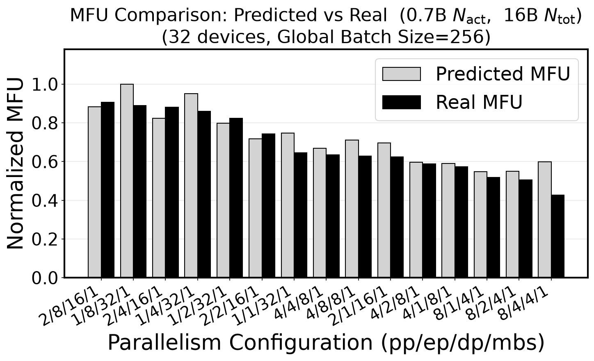
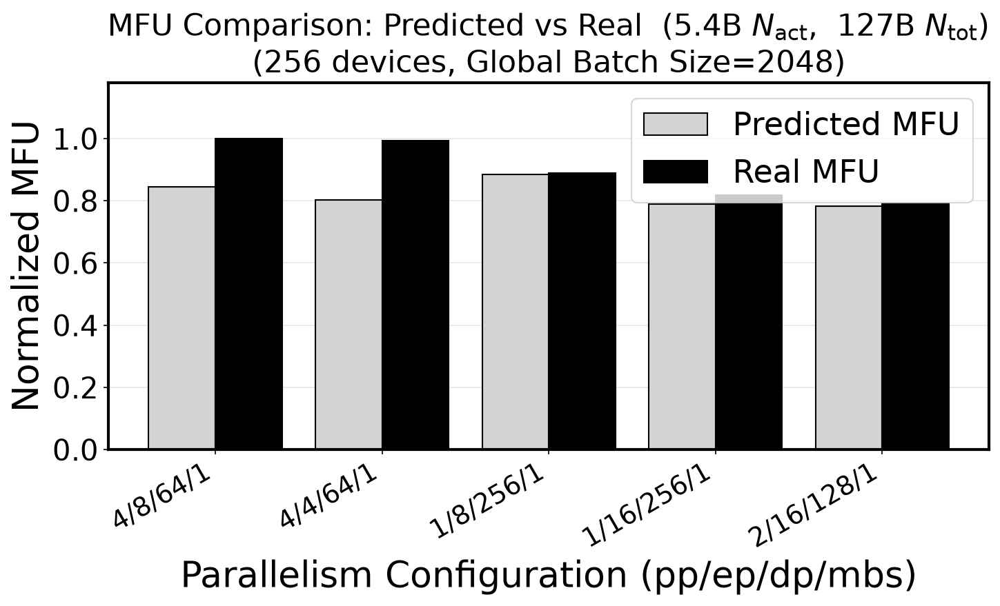
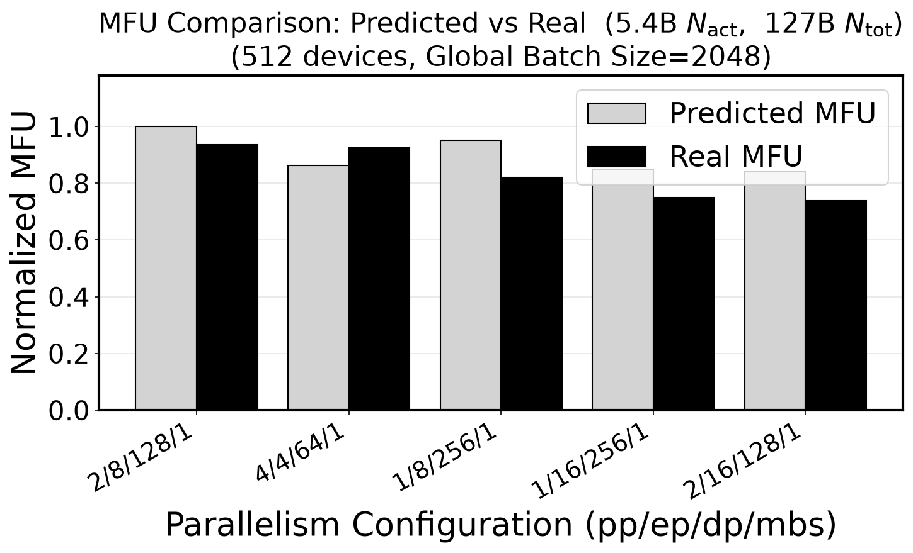
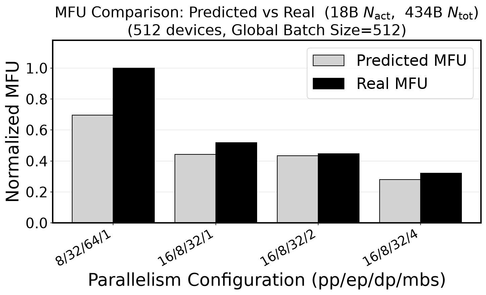

# ScalePlan — LLM Runtime Performance Calculator with Parallelism Search

[](https://creativecommons.org/licenses/by-nc/4.0/)

[](https://arxiv.org/pdf/2608.10605)

Analytical performance modeling for large-scale MoE/Dense LLM training. ScalePlan
predicts MFU (Model FLOPs Utilization), per-device memory, and iteration time for
a given parallelism configuration, and searches the configuration space to find
the best one for a target cluster.

## Validation Against Real Runs

Predicted vs. measured MFU across parallelism configurations on P6-B200
clusters. Each plot is normalized to the highest MFU at that scale, so the
signal to look for is whether predictions track the *shape* of the measured
bars — i.e. whether the model ranks configurations the way real runs do.
Configurations are labeled `pp/ep/dp/mbs`.

<table>
<tr>
<td width="50%"></td>
<td width="50%"></td>
</tr>
<tr>
<td align="center"><b>0.7B active / 16B total</b><br>32 devices, global batch size 256</td>
<td align="center"><b>5.4B active / 127B total</b><br>256 devices, global batch size 2048</td>
</tr>
<tr>
<td width="50%"></td>
<td width="50%"></td>
</tr>
<tr>
<td align="center"><b>5.4B active / 127B total</b><br>512 devices, global batch size 2048</td>
<td align="center"><b>18B active / 434B total</b><br>512 devices, global batch size 512</td>
</tr>
</table>

See [How the Model Works](#how-the-model-works) for what drives these
predictions.

## Features

- **Parallelism Search**: Find optimal tensor (TP), expert (EP), pipeline (PP), context (CP), and data (DP) parallelism configurations, along with activation checkpointing and microbatch size
- **MFU Analysis**: Analytical MFU predictions built on measured kernel and collective timings, not just peak-FLOP ratios
- **Memory Validation**: Reject configurations that exceed device memory before you launch them
- **Topology Tools**: Inspect and assign jobs across cluster network topology (EC2 / Kubernetes)
- **Interactive Web App**: Explore the configuration space with live plots and heatmaps
- **Multiple Output Formats**: Results in text, JSON, and YAML

## Installation

### Prerequisites

- Python 3.11+
- [uv](https://docs.astral.sh/uv/)

### Setup

```bash
git clone https://github.com/dmlc/ScalePlan
cd ScalePlan

# Create the virtual environment and install dependencies
uv sync
```

Re-run `uv sync` only when dependencies change (e.g. after a `git pull` that
updates `pyproject.toml` or `uv.lock`).

### Verify Installation

```bash
uv run python -c "from parallelism_search.searcher import ParallelismSearcher; print('Installation successful')"
```

### Running Commands

Prefix commands with `uv run` to use the project environment automatically:

```bash
uv run python script.py
uv run pytest
```

Or activate it manually: `source .venv/bin/activate`

## Usage

### Parallelism Search (Recommended)

To search a configuration space for the best MFU:

```bash
uv run python parallelism_search/search_entry.py dlcalc/examples/config-p6-search-test.yaml \
    --devices 64 --top-k 10 --max-tp 1 --max-mbs 4
```

This sweeps combinations of TP, EP, PP, CP, DP, activation checkpointing, and
microbatch size, discarding configurations that exceed device memory.

Useful flags: `--max-ep`, `--max-cp`, `--max-etp`, `--memory-limit-fraction`,
`--activation-checkpointing`, `--output-name`, `--no-save`. See
[parallelism_search/README.md](parallelism_search/README.md) for the full list.

Example configs live in `dlcalc/examples/` (model architectures and search
spaces) and `example_configs/` (measured production shapes).

### Single Configuration Analysis

To analyze one specific configuration with no search:

```bash
uv run 3dtrn dlcalc/examples/config-p6-search-test.yaml
```

See [dlcalc/README.md](dlcalc/README.md) for single-config usage details.

### Interactive Web App (Performance Modeling Studio)

For interactive exploration — sliders for every model/data/hardware/parallelism
knob, live MFU and memory readouts, sweep plots, `tp×ep` / `pp×ep` MFU heatmaps,
and a one-click grid search:

```bash
uv run python webapp/server.py
# then open http://127.0.0.1:5057
```

Set `PORT=…` to change the port. See [webapp/README.md](webapp/README.md) for
full UI documentation and the JSON API.

### Cluster Topology Tools

These query the EC2 `describe-instance-topology` API via boto3 and require AWS
credentials in your environment:

```bash
uv run topoviz    # visualize cluster network topology
uv run topoeval   # evaluate a topology for job placement
uv run topoassign # topology-aware job assignment
```

### Example Output

A search produces console output plus (unless `--no-save`) a text summary, a
JSON file for further analysis, and a YAML block ready to paste into a training
config.

```
================================================================================
TOP PARALLELISM CONFIGURATIONS
================================================================================

Rank 1:
  Configuration: tp=1, ep=8, pp=8, cp=1, dp=8, etp=1, act_ckpt=full, mbs=1
  Analytical MFU: 6.75%
  Benchmark MFU: Not available
  Memory per device: 40.72 GB
  Iteration time: 331.531 s

Sample invalid configurations (786 total):
  tp=1, ep=1, pp=1, cp=1, dp=64, etp=1, act_ckpt=none, mbs=1
    Error: Memory exceeds limit: 1131.72GB > 167.40GB
```

## Key Metrics Explained

- **Analytical MFU**: Predicted Model FLOPs Utilization from hardware specs and the performance model
- **Benchmark MFU**: Measured MFU from real training runs, when an MLflow experiment is supplied (see [MLflow integration](#mlflow-integration))
- **MFU Difference**: Gap between predicted and measured
- **Memory per device**: Peak memory usage per GPU/device
- **Iteration time**: Time per training step

## How the Model Works

Predictions are built from measured data rather than peak-FLOP ratios. The
model accounts for:

**Communication**
- DP communication overlap efficiency (first pipeline stage exposure)
- NCCL protocol selection (LL, LL128, Simple) by message size
- Measured collective bandwidth curves (all-reduce, reduce-scatter, all-gather, all-to-all)
- Message chunking overhead for large transfers

**Compute**
- Kernel launch latency (~5–20 μs per kernel, GPU-specific)
- GEMM utilization curves from H100/B200 benchmarks
- SDPA (FlashAttention) forward and backward timing from measurements
- LayerNorm and RoPE empirical kernel timing

**MoE**
- Router GEMM and TopK selection timing
- Token permutation/unpermutation overhead
- Expert-parallel dispatch/combine communication

**Pipeline**
- Fill/drain phases in addition to steady-state 1F1B
- VPP (Virtual Pipeline Parallelism) effects
- Larger relative impact at small microbatch counts

The measured lookup tables live in `benchmarks/results/` and are regenerated by
the scripts in `benchmarks/` (`sdpa_benchmark.py`, `gemm_grouped_benchmark.py`,
`a2a_benchmark.py`, `dp_collectives_benchmark.py`, and others). These require
GPUs; the parquet files are checked in so the model works without them.

For how these predictions compare against real training runs, see
[Validation Against Real Runs](#validation-against-real-runs).

### Known Limitations

- Profiling data covers H100/B200 GPUs; A100 is supported via extrapolation
- Norm/RoPE timing uses synthetic data pending real GPU benchmarks
- Trainium (`trn1n`) uses A100 SDPA timings as a proxy
- Framework-specific optimizations (compiler fusions, etc.) are not modeled
- Cache effects and memory fragmentation are simplified

For detailed technical documentation, see
[docs/mfu_calculation_guide.md](docs/mfu_calculation_guide.md).

## MLflow Integration

Passing `--mlflow-experiment-id` makes the searcher look up measured MFU for each
candidate and report it next to the prediction. This requires a site-specific
module at `parallelism_search/collect_mlflow_benchmarks.py` exposing
`get_benchmark_mfu(experiment_id, job_name)`, since experiment layout and job
naming are deployment-specific. That module is not included in this repository.

Without it, search works normally and **Benchmark MFU** reports
`Not available`.

## Testing

```bash
uv run pytest dlcalc/tests
```

Two integration tests (`test_mfu_golden.py`, `test_comm_cost_audit.py`) depend on
ground-truth CSVs under `dlcalc/tests/data/` and `profile_parse/` that are not
part of this repository, and will error if those are absent.

## Troubleshooting

### Memory Limit Errors

If every configuration exceeds the memory limit:
- Reduce model size parameters in the YAML config
- Raise `--memory-limit-fraction` (default `0.8`) if you want to use more of the device
- Allow higher parallelism degrees, or enable activation checkpointing

## License

ScalePlan is licensed under the [Creative Commons
Attribution-NonCommercial 4.0 International License][cc-by-nc] (CC BY-NC 4.0).
See [LICENSE](LICENSE) for the full text.

In short, you are free to share and adapt this work — including for research
and teaching — provided you give appropriate credit and indicate any changes.
Use for **commercial purposes** (anything primarily directed toward commercial
advantage or monetary compensation) is not permitted under this license.
For commercial licensing, please open an issue to get in touch.

### Third-Party Code

The `dlcalc/` directory is derived from [jfc4050/dlcalc][dlcalc], which is
MIT-licensed (Copyright (c) 2024 Justin Chiu). That code remains available
under the MIT License and is **not** subject to the NonCommercial restriction
above. Its license text is retained at [`dlcalc/LICENSE`](dlcalc/LICENSE); see
[THIRD_PARTY_NOTICES.md](THIRD_PARTY_NOTICES.md) for details.

[cc-by-nc]: https://creativecommons.org/licenses/by-nc/4.0/
[dlcalc]: https://github.com/jfc4050/dlcalc
